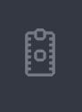
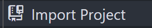
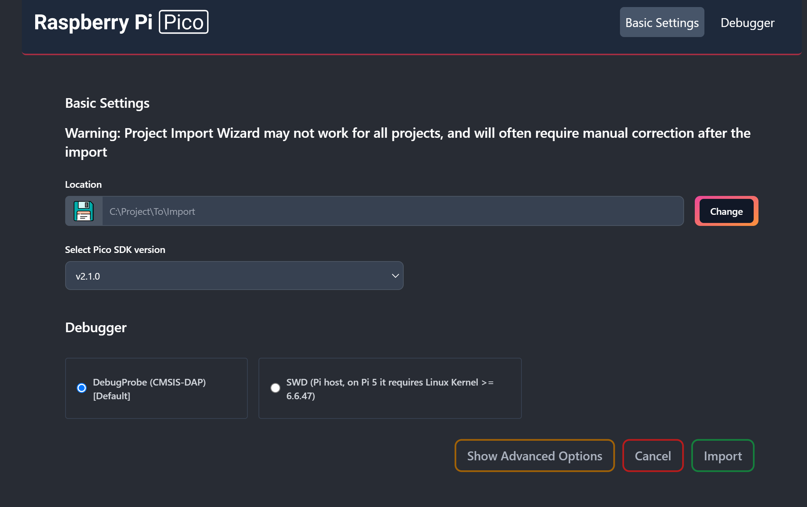
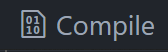

<h1 align="center">Embarcatec | Quarta Atividade Em Grupo</h1>

<div align="center">  
  
</div>

## Objetivo do Projeto

O principal objetivo deste projeto é utilizar o Raspberry Pi Pico W juntamente com um teclado matricial 4x4 e uma matriz de LEDs coloridos WS2812 (5x5) para criar animações visuais interativas. A partir da interação com o teclado, será possível controlar a sequência de acionamento dos LEDs, gerando diferentes tipos de animações de curta duração. O projeto visa integrar os componentes de forma eficaz, proporcionando a manipulação visual dos LEDs a partir de entradas do usuário, explorando a programação do Raspberry Pi Pico W para o controle de hardware, bem como a criação de efeitos de luz dinâmicos e criativos.

## 🗒️ Lista de requisitos

- Teclado matricial 4x4; 
- Microcontrolador Raspberry Pi Pico W; 
- Matriz de LEDs Coloridos (LED-RGB 5x5 WS2812);
- Buzzer Passivo Eletromagnético MLT-8530 SMD 3.6V (Componente opcional).

## 🛠 Tecnologias

1. **Git e Github**;
2. **VScode**;
3. **Linguagem C**;
4. **Software de emulação PuTTy. (Opcional para testes)**
5. **Extensões no VScode do Raspberry Pi Pico Project e CMake**

## 💻 Instruções para Importar, Compilar e Rodar o Código Localmente

Siga os passos abaixo para clonar o repositório, importar no VS Code usando a extensão do **Raspberry Pi Pico Project**, compilar e executar o código.

1. **Clone o repositório para sua máquina local**  
   Abra o terminal e execute os comandos abaixo:
   ```bash
   git clone https://github.com/usuario/projeto.git
   cd projeto

2. **Abra o VS Code e instale a extensão "Raspberry Pi Pico Project" (caso não já a tenha instalada)**
 - No VS Code, vá até "Extensões" (Ctrl+Shift+X)
 - Pesquise por "Raspberry Pi Pico Project"
 - Instale a extensão oficial

3. **Importe o projeto no VS Code**
 - No VS Code, na barra lateral do lado esquerdo clique em "Raspberry Pi Pico Project" 
 - No menu que aparecer clique em 
 - Clicando em "Change" escolha a pasta clonada do repositório
 - Escolha a versão do SDK 2.1.0
 - Clique em "Import"


    


4. **Compile o projeto**
 - Com o projeto aberto no VS Code, pressione 
 - Aguarde a finalização do processo de build

5. **Rode o código no Raspberry Pi Pico**
 - Conecte o Raspberry Pi Pico ao PC segurando o botão "BOOTSEL".
 - Arraste e solte o arquivo `.uf2`, localizado dentro da pasta "build" do seu projeto, gerado na unidade USB montada.
 - O código será carregado automaticamente e o Pico será reiniciado.
 - Caso tenha instalado o driver com o Zadig clique em "Run" ao lado do botão 


## 🔧 Funcionalidades Implementadas:

- Animação feita por José Vinicius, ao apertar a tecla 0, irá aparecer o nome "EMBARCATECH". Caso a tecla A seja acionada, todos os LEDs deverão ser desligados.
- Animação feita por Paola, caso a tecla 5 seja acionada, aparece a animação das operações matemáticas (+, -, x, ÷, =). Caso a tecla B seja acionada, todos os LEDS azuis são ligados.
- Animação feita por Alexsami Lopes, ao apertar a tecla 7, aparece um emoji com olhos que se movimentam e ao fim faz uma cara de surpresa. 
- Animação feita por Sara, caso a tecla 8 seja acionada, é exibindo um coração "arrastando" na matriz de led.
- Animação feita por Marcio, caso a tecla 9 seja acionada, é exibindo uma bandeira do Brasil e o nome BRASIL na matriz de led.
- Animação feita por Ramom Silva, caso a tecla 3 seja acionada, é um olho que pisca lentamente 3 vezes.
- Feature feita por Ramom Silva, ao aperta a tecla C, todos os leds acendem na cor vermelha com intencidade de 80% da capacidade máxima dos leds, para apagar todos os leds, basta apertar a tecla A.
- Animação feita por Pedro Vitor, ao apertar a tecla "D", todos os leds são acessos em 50% de intensidade.
- Animação feita por Moises Amorim Vieira, caso a tecla 2 seja acionada, é exibido um tabuleiro de Xadrez.

## 💻 Desenvolvedores
 
<table>
  <tr>
    <td align="center"><br /><sub><b> Marcio Fonseca </b></sub></a><br />👨‍💻</a></td>
    <td align="center"><br /><sub><b> José Vinicius </b></sub></a><br />👨‍💻</a></td>
    <td align="center"><br /><sub><b> Pedro Barros
    </b></sub></a><br />👨‍💻</a></td>
    <td align="center"><br /><sub><b> Paola Fagundes </b></sub></a><br />👨‍💻</a></td>
    <td align="center"><br /><sub><b> Sara Souza </b></sub></a><br />👨‍💻</a></td>
<td align="center"><br /><sub><b> João Paulo </b></sub></a><br />👨‍💻</a></td>
<td align="center"><br /><sub><b> Moises Amorim </b></sub></a><br />👨‍💻</a></td>
<td align="center"><br /><sub><b> Alexsami Lopes </b></sub></a><br />👨‍💻</a></td>
<td align="center"><br /><sub><b> Ramom Andrade </b></sub></a><br />👨‍💻</a></td>
  </tr>
</table>


## 🎥 Demonstração: 

<div align="center">
  <figure>  
    
    
<figcaption>

**Figura 1** - Demo do Projeto no Wokwi.com - Acessível em: https://wokwi.com/projects/420933409236358145
    </figcaption>
  </figure>
</div>
