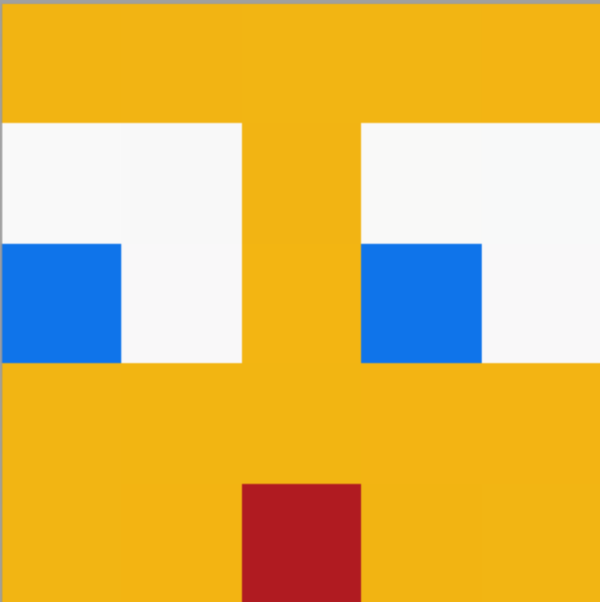
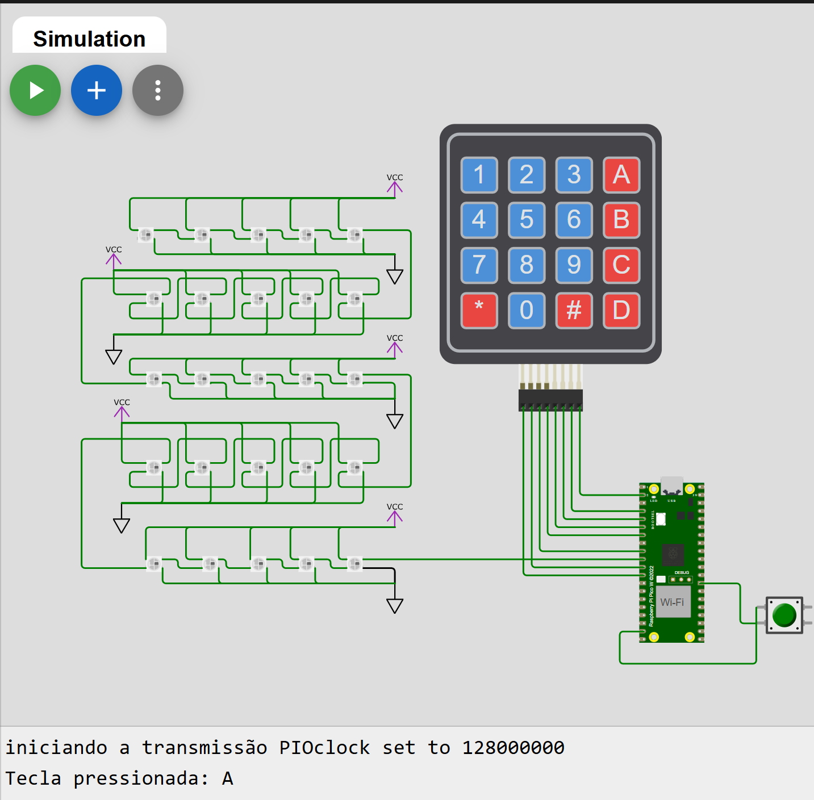

<h1 align="center">Embarcatec | Quarta Atividade Em Grupo</h1>

  
  

## Objetivo do Projeto

O principal objetivo deste projeto é utilizar o Raspberry Pi Pico W juntamente com um teclado matricial 4x4 e uma matriz de LEDs coloridos WS2812 (5x5) para criar animações visuais interativas. A partir da interação com o teclado, será possível controlar a sequência de acionamento dos LEDs, gerando diferentes tipos de animações de curta duração. O projeto visa integrar os componentes de forma eficaz, proporcionando a manipulação visual dos LEDs a partir de entradas do usuário, explorando a programação do Raspberry Pi Pico W para o controle de hardware, bem como a criação de efeitos de luz dinâmicos e criativos.

## 🗒️ Lista de requisitos

- Teclado matricial 4x4.; 
- Microcontrolador Raspberry Pi Pico W;
- Teclado matricial 4x4; 
- Microcontrolador Raspberry Pi Pico W; 
- Matriz de LEDs Coloridos (LED-RGB 5x5 WS2812);
- Buzzer Passivo Eletromagnético MLT-8530 SMD 3.6V (Componente opcional).

## 🛠 Tecnologias

1. **Git e Github**;
2. **VScode**;
3. **Linguagem C**;
4. **Software de emulação PuTTy.**

## 🔧 Funcionalidades Implementadas:

- Animação feita por José Vinicius, ao apertar a tecla 0, irá aparecer o nome "EMBARCATECH". Caso a tecla A seja acionada, todos os LEDs deverão ser desligados.
- Animação feita por Paola, caso a tecla 5 seja acionada, aparece a animação das operações matemáticas (+, -, x, ÷, =).
- Animação feita por Alexsami Lopes, ao apertar a tecla 7, aparece um emoji com olhos que se movimentam e ao fim faz uma cara de surpresa. 
- Animação feita por Sara, caso a tecla 8 seja acionada, é exibindo um coração "arrastando" na matriz de led.
- Feature feita por Ramom Silva, ao aperta a tecla C, todos os leds acendem na cor vermelha com intencidade de 80% da capacidade máxima dos leds, para apagar todos os leds, basta apertar a tecla A.
- Animação feita por Pedro Vitor, ao apertar a tecla "D", todos os leds são acessos em 50% de intensidade.

## 💻 Desenvolvedores
 
<table>
  <tr>
    <td align="center"> <b> Marcio Fonseca </b></a> 👨‍💻</a></td>
    <td align="center"> <b> José Vinicius </b></a> 👨‍💻</a></td>
    <td align="center"> <b> Pedro Barros
    </b></a> 👨‍💻</a></td>
    <td align="center"> <b> Paola Fagundes </b></a> 👨‍💻</a></td>
    <td align="center"> <b> Sara Souza </b></a> 👨‍💻</a></td>
<td align="center"> <b> João Paulo </b></a> 👨‍💻</a></td>
<td align="center"> <b> Moises Amorim </b></a> 👨‍💻</a></td>
<td align="center"> <b> Alexsami Lopes </b></a> 👨‍💻</a></td>
<td align="center"> <b> Ramom Andrade </b></a> 👨‍💻</a></td>
  </tr>
</table>

## 🎥 Demonstração: 

  <figure>  
    
    
<figcaption>

**Figura 1** - Demo do Projeto no Wokwi.com - Acessível em: https://wokwi.com/projects/421343038406179841
    </figcaption>
  </figure>

